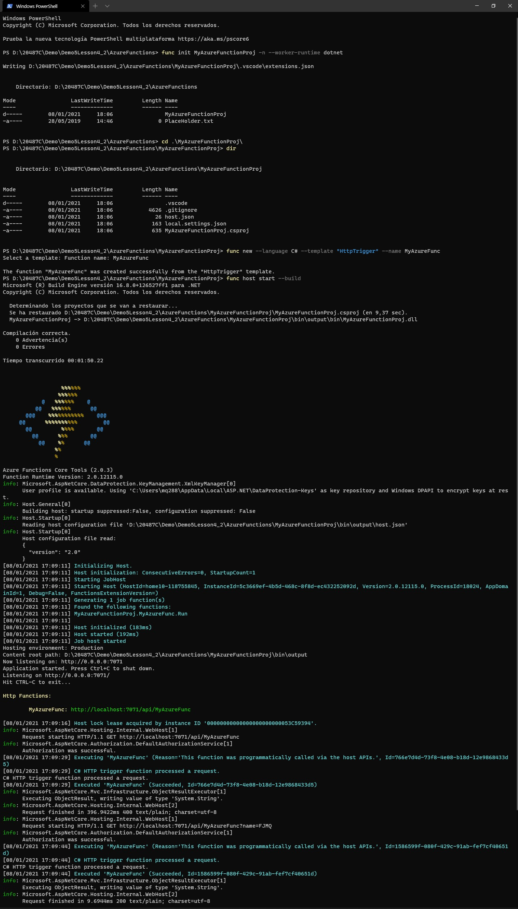
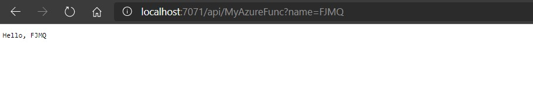
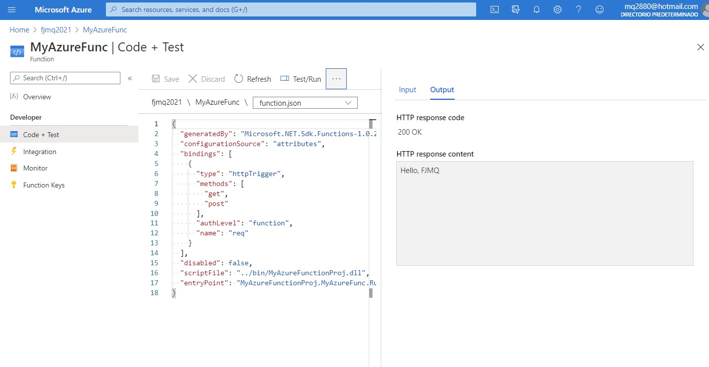

# Module 5: Hosting Services On-Premises and in Azure

# Lesson 4: Implementing Serverless Services

### Demonstration: Developing, Testing, and Publishing an Azure Function from CLI

- Abrimos el portal de azure
- Creamos un nuevo Function App 


- Creamos una nuevo proyecto de funcion desde la consola 

  ```bash
      func init MyAzureFunctionProj -n --worker-runtime dotnet
  ```

- Creamos una nueva funcion desde la consola a partir del proyecto 

  ```bash
      func new --language C# --template "HttpTrigger" --name MyAzureFunc
  ```

- Arrancamos la funcion para probarla

  ```bash
      func host start --build
  ```

  

- probamos **http://localhost:7071/api/MyAzureFunc**. añadimos en la url el parametro con mis iniciales y probamos

  ```cs
      ?name=FJMQ
  ```

  

- Nos logamos en azure desde la consola y publicamos la funcion

  ```bash
      az login
  ```

  

  ```bash
      func azure fjmq2021 publish MyAzureFunc
  ```

  

- Probamos desde el portal

  



